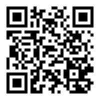

---
hide:
#  - navigation # Hide navigation
#  - toc        # Hide table of contents
---
# Тестування на вебдоступність за допомогою axe-core

## Руслан Іськов

	email: ruslan.rv.ua <at> gmail <dot> com

- Python-розробник
- автор і викладач навчальних курсів з програмування для людей з вадами зору [Python Starter](http://ruslan.rv.ua/python-starter/) та [Python Essential](http://ruslan.rv.ua/python-essential/)
	- методика викладання
	- спеціалізоване програмне забезпечення яке дозволяє демонструвати програмний код користувачам асистивних технологій
- займаюсь питаннями доступності:
	- тестування застосунків, веб-застосунків (сайтів)
	- консультації
	- навчання
	- популяризація універсального дизайну
